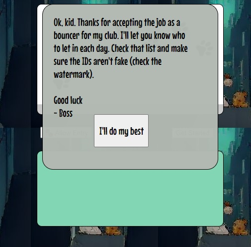
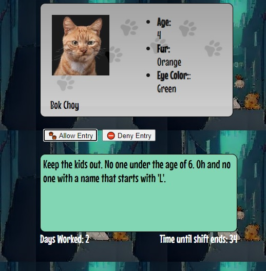
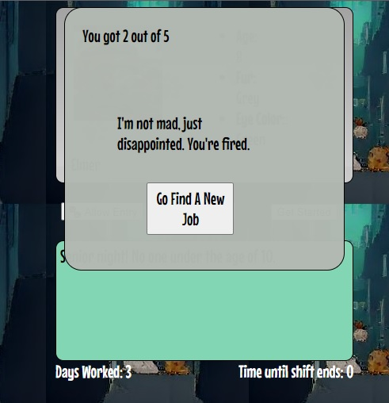

# &#128008; Cat Club Bouncer &#128008;

> “Bad men need nothing more to compass their ends, than that good men should look on and do nothing.”

<nobr>
<nobr>

#### Technologies Used:
-HTML  
-CSS  
-JavaScript  

## Getting Started
You've been hired on as the bouncer at a club for cats. Keep the riff ruff out and don't let anyone in if the boss doesn't want them in. Your shift ends each day when you've checked 5 IDs or when you run out of time.  
  
If you fall 80% accuracy for two days, you're fired! The more days you work, the harder your boss will push you. How long will you be able to keep up?

### Play the game [here](https://timrathert.github.io/Cat-Club-Bouncer/)

### Next Steps
  
Expand generation of ID content and entry criteria.  
  
Implement additional criteria: 'Does the cat presenting the ID match the cat on the ID?  

<!-- Konami Code? -->
