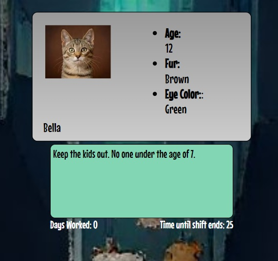

# &#128008; Cat Club Bouncer &#128008;

> “Bad men need nothing more to compass their ends, than that good men should look on and do nothing.”

### Play the game [here](https://timrathert.github.io/Cat-Club-Bouncer/)

<nobr>

<nobr>

#### Technologies Used:
-JavaScript
-CSS 
-HTML

## Getting Started
You've been hired on as the bouncer at a club for cats. Keep the riff ruff out and don't let anyone in if the boss doesn't want them in. Your shift ends each day when you've checked 5 IDs or when you run out of time.  
  
If you fall 80% accuracy for two days, you're fired! The more days you work, the harder your boss will push you. How long will you be able to keep up?

This game was inspired by <a href ="https://papersplea.se/">Papers Please</a>. I wanted to make a playful matching game in the same vein as Papers Please and see what I could learn along the way. Matching is simple enough, so a timer was introduced. Adding a decrementing timer immediately upped the perceived intensity of the gameplay.

### Next Steps
- Would love to blur all other elements when you hover over an ID to inspect it
- Expand generation of ID content and entry criteria
- Implement localStorage API to track gameplay records

### Play the game [here](https://timrathert.github.io/Cat-Club-Bouncer/)

<!-- Konami Code? -->
